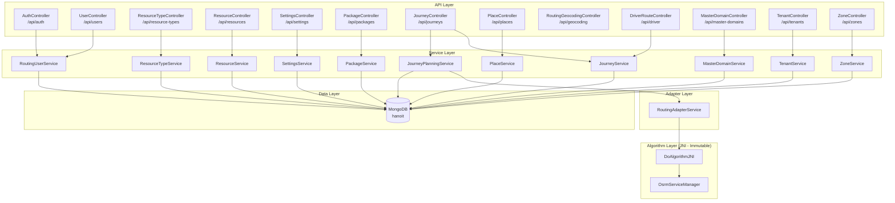

# Architecture Components

```mermaid
graph TD
    subgraph "API Layer"
        AUTH[AuthController<br>/api/auth]
        USERS[UserController<br>/api/users]
        RESTYPES[ResourceTypeController<br>/api/resource-types]
        RESOURCES[ResourceController<br>/api/resources]
        SETTINGS[SettingsController<br>/api/settings]
        PACKAGES[PackageController<br>/api/packages]
        JOURNEYS[JourneyController<br>/api/journeys]
        PLACES[PlaceController<br>/api/places]
        GEOCODING[RoutingGeocodingController<br>/api/geocoding]
        DRIVER[DriverRouteController<br>/api/driver]
        DOMAINS[MasterDomainController<br>/api/master-domains]
        TENANTS[TenantController<br>/api/tenants]
        ZONES[ZoneController<br>/api/zones]
    end

    subgraph "Service Layer"
        USER_SVC[RoutingUserService]
        RESTYPE_SVC[ResourceTypeService]
        RESOURCE_SVC[ResourceService]
        SETTINGS_SVC[SettingsService]
        PACKAGE_SVC[PackageService]
        JOURNEY_SVC[JourneyService]
        PLANNING_SVC[JourneyPlanningService]
        PLACE_SVC[PlaceService]
        DOMAIN_SVC[MasterDomainService]
        TENANT_SVC[TenantService]
        ZONE_SVC[ZoneService]
    end

    subgraph "Adapter Layer"
        ADAPTER[RoutingAdapterService]
    end

    subgraph "Algorithm Layer (JNI - Immutable)"
        ALGO[DoAlgorithmJNI]
        OSRM[OsrmServiceManager]
    end

    subgraph "Data Layer"
        MONGO[(MongoDB<br>hanoit)]
    end

    AUTH --> USER_SVC
    USERS --> USER_SVC
    RESTYPES --> RESTYPE_SVC
    RESOURCES --> RESOURCE_SVC
    SETTINGS --> SETTINGS_SVC
    PACKAGES --> PACKAGE_SVC
    JOURNEYS --> JOURNEY_SVC
    JOURNEYS --> PLANNING_SVC
    PLACES --> PLACE_SVC
    DRIVER --> JOURNEY_SVC
    DOMAINS --> DOMAIN_SVC
    TENANTS --> TENANT_SVC
    ZONES --> ZONE_SVC

    PLANNING_SVC --> ADAPTER
    ADAPTER --> ALGO
    ALGO --> OSRM

    USER_SVC --> MONGO
    RESTYPE_SVC --> MONGO
    RESOURCE_SVC --> MONGO
    SETTINGS_SVC --> MONGO
    PACKAGE_SVC --> MONGO
    JOURNEY_SVC --> MONGO
    PLANNING_SVC --> MONGO
    PLACE_SVC --> MONGO
    DOMAIN_SVC --> MONGO
    TENANT_SVC --> MONGO
    ZONE_SVC --> MONGO
```
