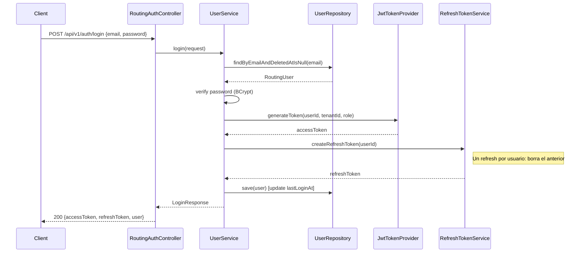
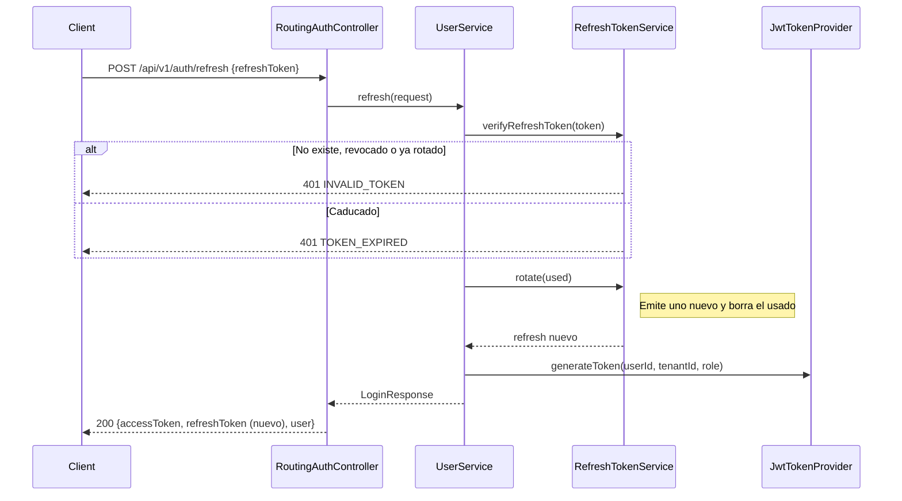

# Auth Login Sequence

```mermaid
sequenceDiagram
    participant Client
    participant AuthController as RoutingAuthController
    participant UserService
    participant UserRepository
    participant JwtTokenProvider
    participant RefreshTokenService

    Client->>AuthController: POST /api/v1/auth/login {email, password}
    AuthController->>UserService: login(request)
    UserService->>UserRepository: findByEmailAndDeletedAtIsNull(email)
    UserRepository-->>UserService: RoutingUser
    UserService->>UserService: verify password (BCrypt)
    UserService->>JwtTokenProvider: generateToken(userId, tenantId, role)
    JwtTokenProvider-->>UserService: accessToken
    UserService->>RefreshTokenService: createRefreshToken(userId)
    Note right of RefreshTokenService: Un refresh por usuario: borra el anterior
    RefreshTokenService-->>UserService: refreshToken
    UserService->>UserRepository: save(user) [update lastLoginAt]
    UserService-->>AuthController: LoginResponse
    AuthController-->>Client: 200 {accessToken, refreshToken, user}
```

# Refresh Rotation Sequence

```mermaid
sequenceDiagram
    participant Client
    participant AuthController as RoutingAuthController
    participant UserService
    participant RefreshTokenService
    participant JwtTokenProvider

    Client->>AuthController: POST /api/v1/auth/refresh {refreshToken}
    AuthController->>UserService: refresh(request)
    UserService->>RefreshTokenService: verifyRefreshToken(token)
    alt No existe, revocado o ya rotado
        RefreshTokenService-->>Client: 401 INVALID_TOKEN
    else Caducado
        RefreshTokenService-->>Client: 401 TOKEN_EXPIRED
    end
    UserService->>RefreshTokenService: rotate(used)
    Note right of RefreshTokenService: Emite uno nuevo y borra el usado
    RefreshTokenService-->>UserService: refresh nuevo
    UserService->>JwtTokenProvider: generateToken(userId, tenantId, role)
    UserService-->>AuthController: LoginResponse
    AuthController-->>Client: 200 {accessToken, refreshToken (nuevo), user}
```

El cliente debe hacer *single-flight*: con dos refresh en paralelo con el mismo token, el segundo
recibe 401 `INVALID_TOKEN`.
