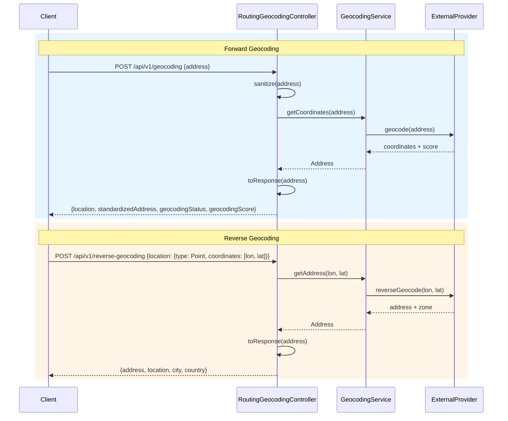

# Geocoding Flow Sequence

```mermaid
sequenceDiagram
    participant Client
    participant GeocodingController as RoutingGeocodingController
    participant GeocodingService
    participant ExternalProvider

    rect rgb(230, 245, 255)
        Note over Client,ExternalProvider: Forward Geocoding
        Client->>GeocodingController: POST /api/v1/geocoding {address}
        GeocodingController->>GeocodingController: sanitize(address)
        GeocodingController->>GeocodingService: getCoordinates(address)
        GeocodingService->>ExternalProvider: geocode(address)
        ExternalProvider-->>GeocodingService: coordinates + score
        GeocodingService-->>GeocodingController: Address
        GeocodingController->>GeocodingController: toResponse(address)
        GeocodingController-->>Client: {location, standardizedAddress, geocodingStatus, geocodingScore}
    end

    rect rgb(255, 245, 230)
        Note over Client,ExternalProvider: Reverse Geocoding
        Client->>GeocodingController: POST /api/v1/reverse-geocoding {location: {type: Point, coordinates: [lon, lat]}}
        GeocodingController->>GeocodingService: getAddress(lon, lat)
        GeocodingService->>ExternalProvider: reverseGeocode(lon, lat)
        ExternalProvider-->>GeocodingService: address + zone
        GeocodingService-->>GeocodingController: Address
        GeocodingController->>GeocodingController: toResponse(address)
        GeocodingController-->>Client: {address, location, city, country}
    end
```
